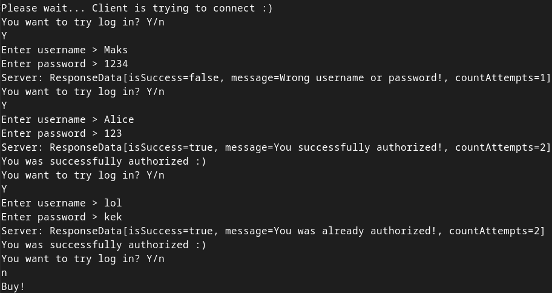
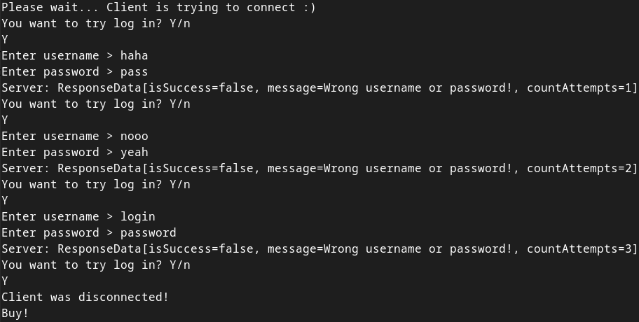

# How to use

1. Start a server:
   `./gradlew :server:run --console plain`
2. Start a client or many clients with command:
   `./gradlew :client:run --console plain`
3. Answer to question 'You want to try log in? Y/n
   ' - **Y**
4. Enter username
5. Enter password
6. Server must send response as:  
   "isSuccess" - true or false,  
   "message" - string with message from server,  
   "countAttempts" - count of auth attempts
7. Repeat steps 3 to 6...

# Default username&passwords

<table>
<tr>
<td>№</td>
<td>Username</td>
<td>Password</td>
</tr>
<tr>
<td>0</td>
<td>Alice</td>
<td>123</td>
</tr>
<tr>
<td>1</td>
<td>Bob</td>
<td>password</td>
</tr>
</table>

# Example of using

* After second successful authorizing
  
* After three failed attempts
    